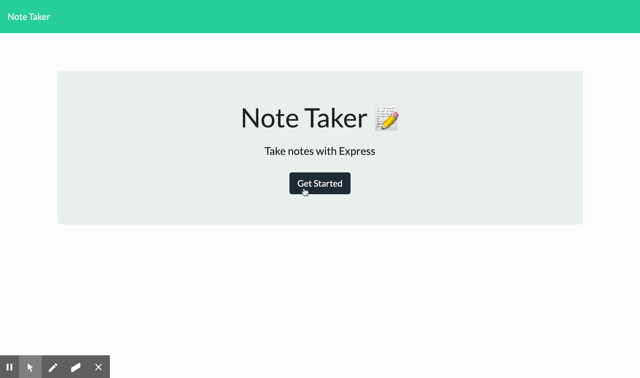

# Note Taker  

### Description
    Create the backend for an application that can be used to write, save, and delete notes.

## Table of contents
* [Description](#Description)
* [Version](#Version)
* [Deployed](#Deployed)
* [Installation](#Installation)
* [Usage](#Usage)
* [Test](#Test)
* [Contributors](#Contributors)
* [Questions](#Questions)
* [License](#License)

### Version 
1.0.0

### Deployed Project
GitHub Repo: https://github.com/s2hon/note-taker 

Heroku: https://note-taker-ver1.herokuapp.com/

## Installation
npm install

## Usage
to go to the Heroku link down below to start using the app or to git clone this repo

## Tests
n/a

## Contributors

s2hon

## Questions
Follow me on GitHub:  
Ask me anything: staci.shon@gmail.com  

## License
MIT © Staci Shon 

